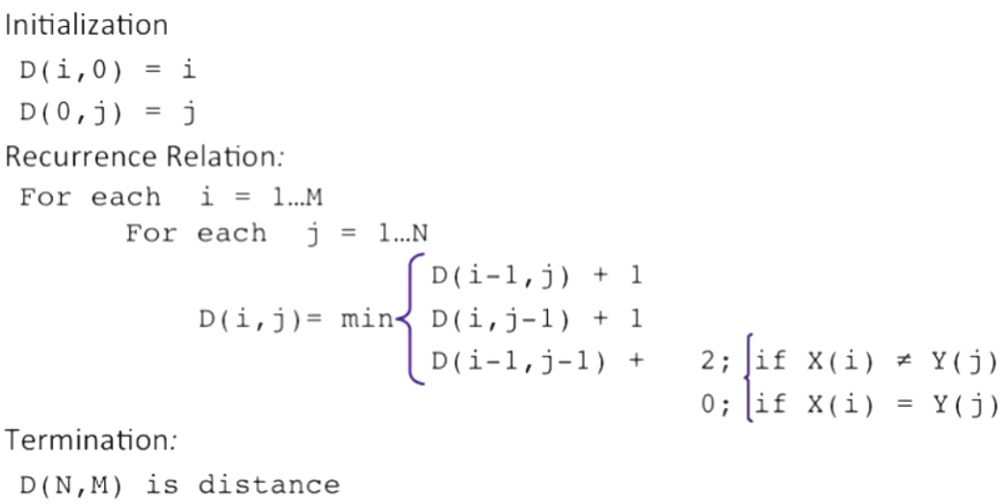

## [Reference - Speech and Language Processing](https://web.stanford.edu/~jurafsky/slp3/)
* [Dan Jurafsky](https://web.stanford.edu/~jurafsky/)
* [Course Link](https://pan.baidu.com/s/1VjCFjwZYWkva6KBrohK8Lw)
> Consider as basic NLP course.

---
## 1.week_01
### 1.1.Ambiguity makes NLP hard: Crash blossoms; ambiguity is pervasive.
### 1.2.Basic text processing
* Regular expression
* Word tokenization
> Word tokenization in Chinese --> word segmentation --> `Maximum matching` / greedy algorithm

* Word normalization and stemming
> * Normalization
> * Case folding
> * Lemmatization
> * Stemming -- morphology -- crude chopping of affixes --> `Porter's algorithm`

* Sentence segmentation
> Decision tree

### 1.3.Edit distance
* Defining minimum distance
> * from words to sentences -- consider words as letters -- several words with different formation may with same meaning; e.g: `Stanford President John Hennessy` and `Stanford University President John Hennessy` consider as one word when implementing edit distance

* Compute minimum distance
> * Dynamic programming / Levenshtein (`substitute` cost 2 steps)
> * 

* Backtrace for editing distance
* Weighted edit distance
* Minimum edit distance in computational biology
> * `Needleman-Wunsch algorithm`
> * The overlap detection variant
> * The local alignment problem -- longest common substring -- `Smith-Waterman algorithm`

## 2.week_02
### 2.1.Introduction to N-grams
* Probabilistic language models -- chain rule
> $$P\left( w_{1}w_{2}\ldots w_{n}\right) =\prod _{i}\left( w_{i}|w_{1}w_{2}\ldots w_{i-1}\right)$$

* Markov assumption
> * $$P\left( w_{1}w_{2}\ldots w_{n}\right) =\prod _{i}\left( w_{i}|w_{i-k}\ldots w_{i-1}\right)$$
> * Unigram / bigram /trigram / N-gram model
> * Long-distance dependencies

### 2.2.Estimating N-gram probabilities
* bigram probabilities
> * $$P\left(w_{i} | w_{i-1}\right) =\dfrac {c\left( w_{i-1},w_{i}\right) }{c\left( w_{i-1}\right) }$$
> * Practical issues: Do everything in log space to avoid underflow and speed up calculation.
> * $$\begin{aligned}p_{1}\times p_{2}\times p_{3}\times p_{4}=\log p_{1}+\log p_{2}+\log p_{3}+\log p_{4}\end{aligned}$$
> * Toolkits -- `SRILM`, `Google N-Gram Release`, `Google Book N-Gram`

### 2.3.Evaluation and perplexity

## 3.week_03

## 4.week_04

## 5.week_05

## 6.week_06

## 7.week_07

## 8.week_08